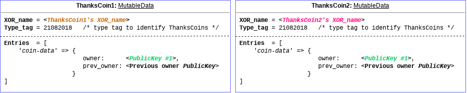
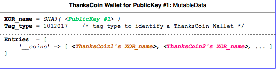
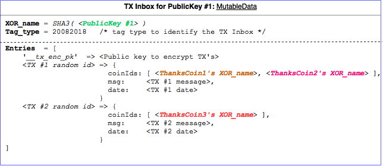

# SAFE Coins Wallet

A package which provides the functionality for an altcoin wallet on the [SAFE Network](https://maidsafe.net).
Any SAFE application can use this package to implement an altcoin wallet by using the
provided API.

This library is used by the [SAFE Wallet App (`safe://safewallet.wow`)](safe://safewallet.wow) available on the SAFEnet ([a live mockup is also available here](https://bochaco.github.io)), and more information about it can be found on [this post in the SAFEnet forum](https://safenetforum.org/t/introducing-safe-wallet-app/11764?u=bochaco).

## The SAFE Altcoins

In the same way that the `safecoin` is expected to be just a `MutableData` on the SAFE Network with a specific and tag type reserved for it (i.e. no application will be able to create a MutableData with this tag type but the network itself when rewarding farmers), altcoins on the SAFEnet can also be implemented by creating MutableData's with a predefined tag type, and a mechanism for their supply.
There are several proposals for how altcoins can be implemented and mined/minted on the SAFEnet. Just as an example, a proposal and good discussion can be found in [this thread on the SAFEnet forum](https://safenetforum.org/t/on-creating-safe-alt-coins/7192?u=bochaco).

## The `ThanksCoins`

The ThanksCoin is only a prototype of an altcoin in the SAFEnet, it has not value and it can be minted by any application, it has no value in any market, and can be used only to play with its ThanksCoin wallet.

The following diagram depicts what's the internal data stored in a MutableData so as to be recognised as a `ThanksCoin` by a wallet:



The `XORName` is a random address in the SAFEnet which is generated automatically by the SAFE API when creating the Public MutableData.

In order to have a Public MutableData to be recognised by a wallet as a ThanksCoin its `Tag_type` value has to be set to `21082018`.

Finally, since MutableData ownership transfer is not available yet on the SAFEnet, in order to mimic the transfer of ownership, the ThanksCoins contain a single entry which key is `coin-data` and its value is a serialised JSON containing the current (`owner`) and previous owner (`prev_owner`) of the coin.

The first `ThanksCoin` wallet implementation is available within the [SAFE Wallet application (`safe://safewallet.wow`)](safe://safewallet.wow) on the SAFEnet which can be used to play with these ThanksCoins.

#### The SAFE Faucet

In order to receive free ThanksCoins which can be used in the SAFE Wallet app, you can visit the [SAFE Faucet app (`safe://safefaucet.wow`)](safe://safefaucet.wow) on the SAFEnet and claim free coins in exchange of feedback about the SAFE Wallet app. Note you first need to create a ThanksCoin wallet in the SAFE Wallet app to be able to receive your free ThanksCoin's.

## The Coin Wallet

The coin wallet is just a list coins' addresses that are owned by a public key, and it is stored on the SAFEnet as a Private MutableData:



The `Tag_type` for a ThanksCoin wallet is defined to be set to `1012017`.

The address at which the wallet is stored is calculated in a deterministic way so it can be found/shared with any other wallet application which implements the same specification. In the current implementation the address is calculated by applying the `SHA3` to the public key owning the coins listed within the wallet. However, any app which wants to access the wallet's Private MutableData will need the encryption keys to be able to read the content, thus the app needs to provide an import mechanism for these encryption keys.

The wallet could alternatively be stored at a random address which is kept private to the user's account. In this case the mechanism to import/use the wallet with another compatible wallet application will need to also consider that the address cannot be determined from the public key but by importing the XOR address of the wallet into the app, along with the encryption keys as mentioned before.

One option is to make use of the MutableData serialisation mechanism provided by the SAFE API, and have the app to keep the serialised version of the wallet's Private MutableData. By doing, so both the XOR address and the encrpytion keys are imported together, and this is the mechanism currently implemented by this package/lib.

As mentioned before, the wallet just contains the list of coins that are owned by the public key the wallet is associated to. In current implementation this is achieved by keeping a single entry in the wallet's MutableData with key `__coins` which value is a list (a serialised JSON format list) of XOR addresses of each of the coins.

If a mechanism like BIP32 is used, it is then needed to have the wallet to keep the list of coins owned by more than a single public key. The wallet's MutableData entries could contain one entry per derived public key which value is the list of coins owned by that public key. The support of this type of wallet is planned to be incorporated in this library/package in the future.

## The TX (transactions) Notifications Inbox

As mentioned above, since the coins on the SAFEnet are just MutableData's owned by one/multiple public key/s, when a coin's ownership is transferred to a different public key, the recipient needs to be notified and provided with the list of addresses of coins that were transferred. This is why the wallet application can expose an inbox to receive such a notifications, this is known as the `TX inbox`:



The TX inbox is a Public MutableData which address can be calculated by applying the SHA3 to the public key, and its `Tag_type` is predefined to be `20082018`.

Each transaction is notified by creating a new entry in the TX inbox of the receiving public key, making sure it is encrypted beforehand.

In order to keep the privacy of the transactions to be readable by only the recipient, the TX Inbox contains an entry with key `__tx_enc_pk` and which value contains the public key that can be used to encrypt any notification before it's inserted in the same MutableData.

Each transaction is inserted in the TX inbox MutableData with a random identifier as the entry's key, and it's value containing (as a serialised JSON) the list of addresses of the coins being transferred (`coinIds`), a message string (`msg`) and the timestamp of the transaction (`date`).

The wallet application periodically checks if new entries were inserted into the TX inbox, and in such a case it reads the TX information copying the list of coins into the wallet's MutableData to reflect the new balance.

## The API

Any application can use this package to implement an altcoin wallet without needing to implement the client code to manipulate the coins and the wallet information on the SAFEnet. At the moment, this is in its early stage and only the `ThanksCoin's` are supported, but it is planned to support different type of SAFEnet altcoins, and even `safecoins`.

TODO: briefly explain API functions

## Use Cases diagrams
TODO
- Create a wallet
- Read TX inbox for new TX
- Read/Update wallet
- Transfer coin and send TX notifications


## How to use it
Install the `npm` dependency in your project:
```
npm i --save safe-coins-wallet
```
Then use the API:
```js
const safeCoinsWallet = require('safe-coins-wallet');

safeCoinsWallet.createWallet(...)
  .then(function (wallet) { ... });
```

## License

This project is licensed under the MIT License - see the [LICENSE](LICENSE) file for details.
